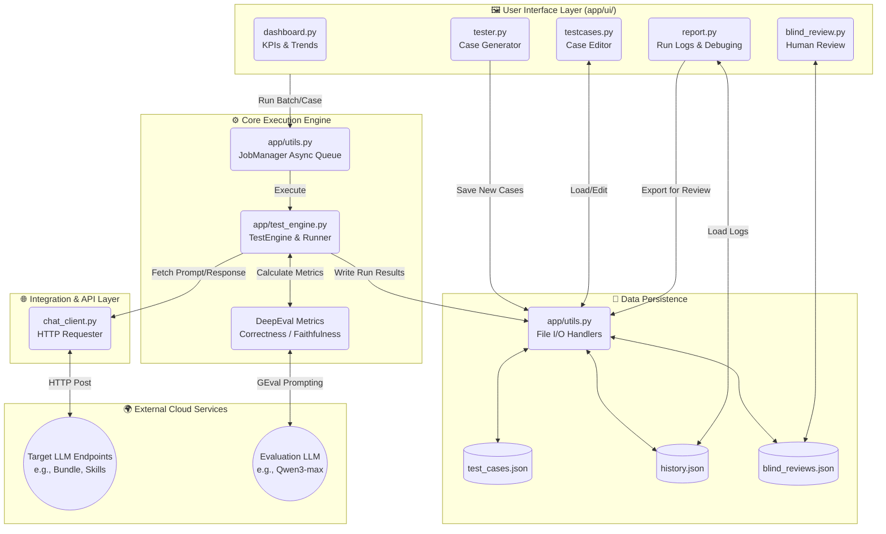

# Chatbot AI Tester - Architecture Design

## Overview
The **Chatbot AI Tester** is a lightweight, Python-based test automation framework designed specifically to interact with, evaluate, and benchmark Large Language Model (LLM) endpoints (like "Bundle API" and "Skills API"). 

The system leverages **Streamlit** for its graphical user interface, a simple JSON file system for data persistency, and the **DeepEval** library as the cognitive test execution engine to determine if generated chat responses match expectations (`Correctness` and [Faithfulness](file:///Users/duyufei/Library/Python/3.9/lib/python/site-packages/deepeval/metrics/faithfulness/faithfulness.py#35-338)).

## Architecture Diagram

---

## Component Breakdown

### 1. Presentation Layer (Streamlit UI)
The `app/ui` directory holds the interactive web application, separated logically into operational domains:
- **`tester.py`**: Allows users to interactively generate multi-turn or single-turn test cases by prompting an LLM (Qwen). Users can approve generated scenarios and commit them to the test case database.
- **`testcases.py`**: The "Test Case Library" management page. Renders `test_cases.json` via an editable data grid. Users can alter `expected_output`, configure `score thresholds`, tag conversations by `id`, and trigger "Run Selected".
- **`report.py`**: The historical execution viewer. Parses `history.json` and reconstructs the data into flat UI tables (unrolling nested multi-turn JSON into sequential rows) including `passed` state, execution latency, `Raw` metadata, and `TTFT`.
- **`dashboard.py`**: Analytical dashboard visualizing pass rates and latency graphs over time.
- **`blind_review.py`**: Facilitates manual human-in-the-loop review for subjective output.

### 2. Execution Engine (`app/test_engine.py`)
This is the core nervous system of the platform.
- **`TestEngine` Class**:
  - Initializes metric schemas using `DeepEval` (e.g., `GEval` Correctness, `FaithfulnessMetric`). 
  - On startup, it runs an asynchronous **dummy warm-up** routine against the NLP models to absorb heavy loading latency.
  - Exposes `run_case`, `run_multi_turn_case`, and `run_batch` handlers.
- **Metric Evaluation**: Uses a designated "evaluator" model (configured via `.env` like `qwen3-max`) to determine mathematical score similarities (>= 0.5 designates a passage threshold).

### 3. API Client (`chat_client.py`)
Responsible for abstracting the actual LLM under test.
- Sends structured HTTP requests targeting `api_name` (e.g. `Bundle API` vs `Skills API`).
- Extracts metadata such as `thinking` process blocks, retrieved `inform_base` documents, pure `result` strings, and raw payload data.

### 4. Persistence System (`app/utils.py` & `data/`)
Because this architectural design relies on a filesystem-based datastore (instead of SQL/NoSQL), `utils.py` manages all State constraints and file I/O safely.
- Modifies `.json` snapshots (`load_data`, `save_data`, `save_history`).
- Houses the `JobManager` thread daemon for running tests purely in the background via threading, preventing UI freezing during large sequential batch runs.

## Data Flow: Executing a Test Configuration
1. User highlights rows in `testcases.py` and hits **Run**.
2. Streamlit hands the selected DataFrame dictionaries to `utils.run_background_job()`.
3. The Async `JobManager` boots a background thread and begins passing `case_data` sequentially to `TestEngine.run_batch()`.
4. `TestEngine` makes HTTP hits to target endpoints via `chat_client.py` measuring round-trip Latency and Time-To-First-Token (TTFT).
5. The raw output is forwarded to the internal `DeepEval` logic which asks the `EvalAPI` (Qwen3) "Does this actual semantic answer match the user's expected semantic answer?".
6. A score (0.0 - 1.0) is returned. If `>= 0.5`, the row `passed`.
7. `TestEngine` compiles all turns, latency stats, and scores into a JSON dict and calls `utils.save_history()`.
8. The UI (in `report.py`) reads this new history snapshot and presents it back to the user with actionable buttons ("Update Expect Result", "Rerun", "Export to PDF/Review").
